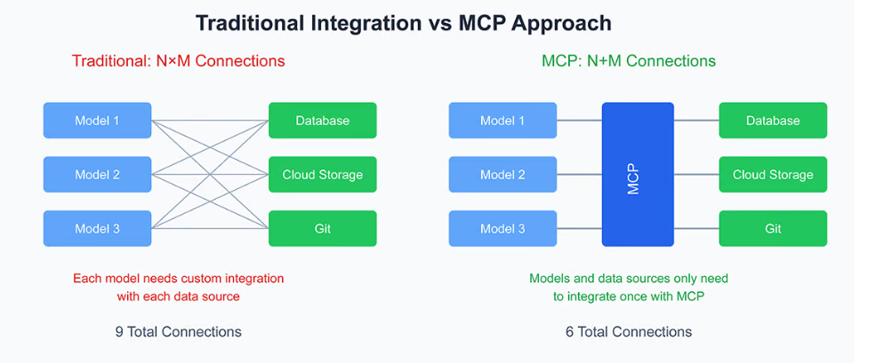
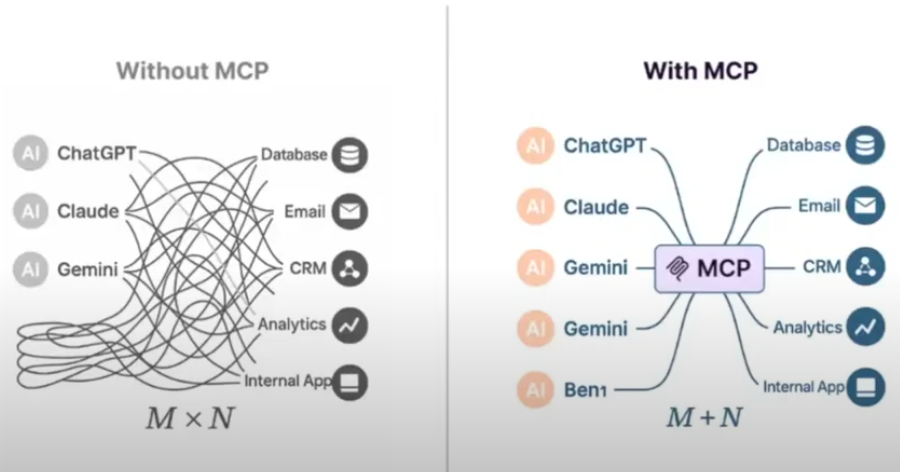
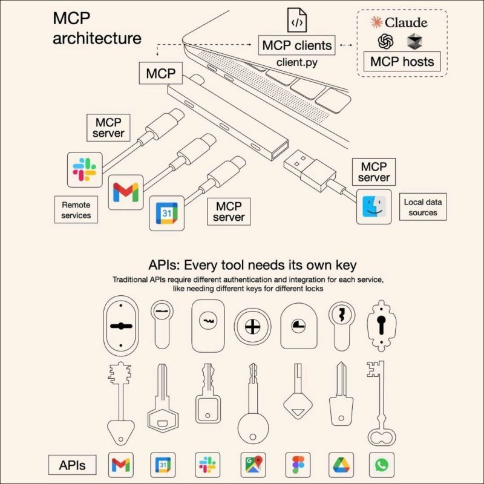

## 🧠 Objetivo

> Criamos o **LangGraph** + **LangChain OpenAI** que utilize ferramentas simples para responder ao usuário.


> Agora vamos criar uma agnte com MCP


## 1️⃣ Criar o ambiente do projeto

tenha o python3.10 instalado:

python3.10 --version

depois

```bash
python3.10 -m venv .venv
source .venv/bin/activate
```

---

## 2️⃣ Instalar dependências

```bash
pip install langchain-openai

```

e

```bash
pip install langgraph python-dotenv

```

---

## 3️⃣ Criar os arquivos do projeto

```bash
touch main.py tools.py .env
```

---

## 4️⃣ 📁 Estrutura final

```
agente_langgraph/
├── .env
├── .gitignore
├── main.py
├── tools.py
└── .venv/
```

---

### 3. Configure sua API key

Crie um arquivo `.env` na pasta do projeto:

```env
OPENAI_API_KEY=sk-sua_chave_aqui
```

> 📝 **Como obter uma API key:**
>
> 1. Acesse [platform.openai.com](https://platform.openai.com)
> 2. Faça login ou crie uma conta
> 3. Vá em "API Keys" e crie uma nova chave
> 4. Copie e cole no arquivo `.env`

Crie o arquivo .gitignore
No arquivo `.gitignore`, adicione:

```gitignore
# Ambiente virtual
.venv/
venv/
env/

# VSCode
.vscode/

# Arquivo de variáveis de ambiente
.env

# Cache do Python
__pycache__/
*.pyc
*.pyo
*.pyd

# Arquivos de log ou temporários
*.log
*.tmp

# Configuração de dependências (caso seja gerado automaticamente)
pip-wheel-metadata/
*.egg-info/
```

# Parte 1: MCP

Model Context Protocol (MCP) Para Sistemas de IA Generativa

### O Que é o Model Context Protocol (MCP)?

> O Model Context Protocol (MCP) é, essencialmente, um protocolo aberto e universal que padroniza a forma como aplicações de IA interagem com dados e serviços externos.

> É uma especificação aberta criada para padronizar como modelos de linguagem grande (LLMs) e agtentes de IA se conectam a dados, ferramnetas e serviços externos. Lançado pela Antropic em novembro de 2024.

-   Em vez de cada sistema de IA precisar de conectores específicos para cada fonte de dados (o que resultava no problema “M x N”, onde M modelos precisavam integrar com N ferramentas diferentes), o MCP propõe um caminho único. Com ele, modelos generativos e Agentes de IA podem acessar bases de dados, APIs, arquivos e outras ferramentas através de um protocolo unificado, independentemente de quem forneça o modelo ou a ferramenta.



Model Context Protocol (MCP) é um protocolo aberto e um framework open-source concebido para resolver um desafio central da IA moderna: como permitir que modelos de linguagem (LLMs) — como Claude, GPT ou outros modelos open-source — interajam com ferramentas, serviços e dados externos de forma padronizada e segura.



🔌 Muitas vezes descrito como o “USB-C das aplicações de IA”, o MCP propõe um conector universal que elimina a necessidade de integrações manuais e plugins específicos para cada sistema. Em vez disso, os modelos que implementam MCP podem ligar-se a qualquer servidor compatível — desde um Google Drive até uma base de dados interna — usando a mesma estrutura de comunicação.



## Funcionamento básico?

Ótimo! Vamos fazer um exemplo **bem prático e passo a passo** com os elementos que você mencionou:

---

## 🔧 **Cenário:**

Você tem:

1. **Sua API** (ex: `meu-sistema.com`) — onde roda seu código/backend.
2. **API da OpenAI** — onde você envia prompts para o ChatGPT ou GPT-4.
3. **Ferramenta externa: GitHub** — que você quer consultar, por exemplo, para buscar issues ou pull requests de um repositório.

E agora você quer usar **MCP (Model Context Protocol)** para **padronizar a comunicação entre esses componentes**, em vez de fazer "gambiarras" com integrações específicas para cada ferramenta.

---

## 📦 Sem MCP (o jeito tradicional):

-   Seu código chama a OpenAI via REST.
-   A OpenAI não consegue acessar diretamente o GitHub.
-   Então **você precisa escrever código** que:

    -   Consulta a API do GitHub.
    -   Pega a resposta.
    -   Formata.
    -   Injeta essa informação no prompt da OpenAI manualmente.

👎 Isso é o "problema M x N": muita integração manual.

---

## 🔌 Com MCP (o jeito padronizado):

-   A **OpenAI (ou Claude)** funciona como **MCP Client**.
-   O **GitHub** (ou um conector para ele) é o **MCP Server**.
-   Você registra o GitHub como uma **ferramenta externa acessível via MCP**.
-   A OpenAI pode dizer:
    👉 "Quero acessar `listIssues` do repositório X".

O protocolo MCP define:

-   Como esse pedido deve ser feito.
-   Como o GitHub responde.
-   Tudo isso em um formato padronizado (JSON).

---

## 📘 Exemplo real com MCP:

### 🧠 Seu LLM (MCP Client) manda isso para o MCP Server:

```json
{
    "tool_call": {
        "name": "github.list_issues",
        "parameters": {
            "repo": "leonardo/meu-projeto",
            "state": "open"
        }
    }
}
```

### 🗃️ Seu conector GitHub (MCP Server) responde:

```json
{
    "tool_response": {
        "tool_name": "github.list_issues",
        "data": [
            {
                "id": 1,
                "title": "Bug no login",
                "created_at": "2025-07-25T12:00:00Z"
            },
            {
                "id": 2,
                "title": "Melhorar performance da API",
                "created_at": "2025-07-27T09:30:00Z"
            }
        ]
    }
}
```

### 🧠 O LLM interpreta essa resposta:

E usa esse conteúdo para compor a resposta final ao usuário como:

> "Encontrei 2 issues abertas no repositório `leonardo/meu-projeto`: uma sobre login e outra sobre performance."

---

## 🏗️ Como você conecta isso no seu código?

1. **Você implementa um MCP Server** na sua API para expor dados (ex: de um banco interno, GitHub, etc.).
2. Você registra essa ferramenta no agente ou modelo que está usando (Claude, OpenAI, etc.).
3. O modelo pode agora chamar essa ferramenta diretamente via protocolo MCP.

---

## 🔄 Fluxo resumido:

```
Usuário → Sua API → OpenAI (MCP Client) → GitHub (MCP Server) → OpenAI → Sua API → Usuário
```

---

## 📌 Conclusão:

Com **MCP**, sua OpenAI (ou outro LLM) pode conversar com serviços externos (como GitHub, Notion, Google Drive, seu banco de dados, etc.) sem você precisar escrever integrações específicas. Basta os dois lados falarem o **mesmo protocolo**.

Se quiser, posso te mostrar um mini exemplo de código com MCP client/server simulado. Deseja?

### ✅ **O que é o MCP Client?**

O **MCP Client** é geralmente o **modelo de linguagem (LLM)** ou o **agente de IA** que **faz a solicitação** de dados, ferramentas ou serviços externos. Ele **consome o contexto**.

Ou seja:

-   Ele quer **acessar informações** (ex: documentos, bancos de dados, APIs).
-   Ele envia uma **requisição padronizada** usando o protocolo MCP.
-   Exemplo: Claude, ChatGPT, ou qualquer LLM compatível com MCP atuando como "cliente".

🧠 **Pense nele como:**

> “O cérebro que pergunta: Me diga o que tem nesse banco de dados” ou “Busque o histórico do cliente X”.

---


### ✅ **O que é o MCP Server?**

O **MCP Server** é o **serviço externo**, **base de dados** ou **ferramenta** que **responde** às requisições feitas pelo cliente MCP.

Ou seja:

-   Ele **expõe dados ou funcionalidades** via o protocolo MCP.
-   Ele entende as mensagens do MCP Client e responde de forma padronizada.
-   Pode ser: Google Drive, Notion, API REST, MySQL, ERP da empresa, etc.

🗂️ **Pense nele como:**

> “O servidor que responde: Aqui estão os dados que você pediu” ou “Aqui está a resposta da API que você requisitou”.

---

### 🧩 Analogia com cliente-servidor tradicional:

| Papel        | Analogia Web   | MCP Contexto                          |
| ------------ | -------------- | ------------------------------------- |
| **Cliente**  | Navegador Web  | LLM ou Agente de IA (Claude, GPT)     |
| **Servidor** | Site / API Web | Banco de dados, API externa, arquivos |

---

### 💡 Exemplo de fluxo:

1. Um agente LLM recebe a tarefa: "Me diga quanto esse cliente gastou no último ano".
2. Ele atua como **MCP Client** e envia uma requisição via MCP.
3. O **MCP Server** que representa o banco de dados da empresa responde com os dados.
4. O LLM processa os dados e responde ao usuário final com a análise.

---

Estudar:
https://www.decodeai.in/what-is-mcp-model-context-protocol-and-why/
