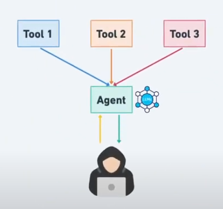
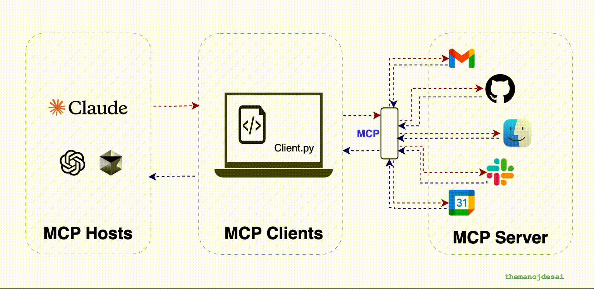
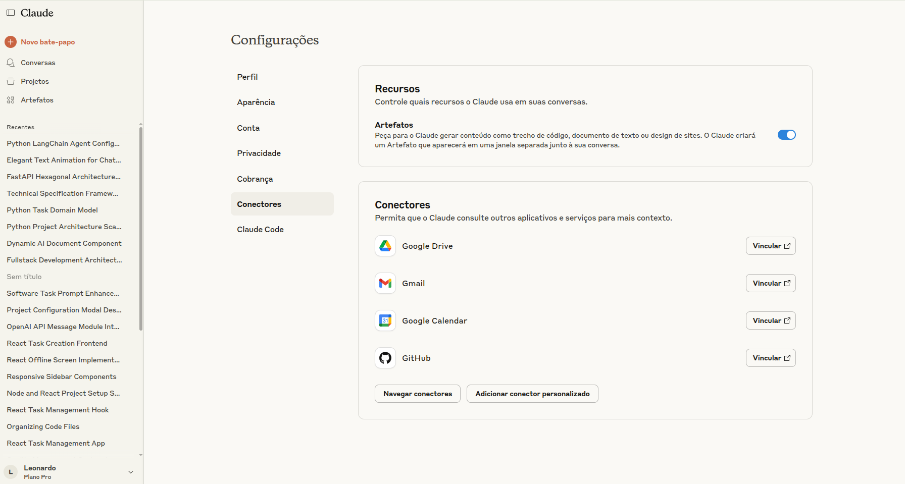

Criamos um agente IA com langchain

> Criamos um agente que se conecta com uma llm com o **LangGraph** + **LangChain OpenAI** que utilize ferramentas simples para responder ao usuário.



> Agora vamos criar uma agente com MCP.

criar um agente de IA com Langchain que usa o MCP Server do GitHub para criar uma issue automaticamente.

https://smithery.ai/


# 🤖 Tutorial: Criando um Agente IA para GitHub

## 🎯 O que você vai aprender

Neste tutorial, você criará um agente de IA que pode:

-   Conversar em linguagem natural
-   Criar issues no GitHub automaticamente
-   Conectar-se ao GitHub usando suas credenciais

**Nível:** Iniciante  
**Tempo estimado:** 30 minutos

---

## 🛠️ Pré-requisitos

Antes de começar, você precisa ter:

-   Python 3.10 ou superior instalado
-   Uma conta no GitHub
-   Uma conta na OpenAI (para usar o ChatGPT)
-   Terminal ou prompt de comando

---

## 📋 Passo 1: Preparando o Ambiente

### 1.1 Criar a pasta do projeto

```bash
# Crie a pasta do projeto e entre nela
mkdir agente-github
cd agente-github
```

### 1.2 Criar e ativar o ambiente virtual

```bash
# Crie o ambiente virtual
python3.10 -m venv .venv

# Ative o ambiente virtual
# No Linux/macOS:
source .venv/bin/activate

# No Windows (PowerShell):
.venv\Scripts\Activate.ps1

# No Windows (CMD):
.venv\Scripts\activate.bat
```

> 💡 **Dica:** Quando o ambiente estiver ativo, você verá `(.venv)` no início da linha do terminal.

### 1.3 Instalar as dependências

```bash
pip install langchain langchain-openai python-dotenv PyGithub
```

---

## 🔑 Passo 2: Configurando as Credenciais

### 2.1 Obter token do GitHub

1. Acesse: [https://github.com/settings/tokens](https://github.com/settings/tokens)
2. Clique em "Generate new token" → "Generate new token (classic)"
3. Em "Note", digite: "Agente IA LangChain"
4. Em "Select scopes", marque:
    - `repo` (para criar issues)
    - `read:user` (para ler informações básicas)
5. Clique em "Generate token"
6. **Copie o token gerado** (você só verá ele uma vez!)

### 2.2 Obter API key da OpenAI

1. Acesse: [https://platform.openai.com](https://platform.openai.com)
2. Faça login ou crie uma conta
3. Vá em "API Keys" no menu lateral
4. Clique em "Create new secret key"
5. **Copie a chave gerada**

### 2.3 Criar arquivo de configuração

Crie um arquivo `.env` na pasta do projeto:

```env
OPENAI_API_KEY=sk-sua_chave_openai_aqui
GITHUB_TOKEN=ghp_seu_token_github_aqui
GITHUB_USERNAME=seu_usuario_github
GITHUB_REPO=nome_do_repositorio
```

> ⚠️ **Importante:** Substitua os valores pelos seus tokens reais!

---

## 📁 Passo 3: Estrutura do Projeto

Crie os arquivos necessários:

```bash
# Criar arquivos
touch main.py github_tool.py .gitignore
```

Estrutura final:

```
agente-github/
├── .env
├── .gitignore
├── main.py
├── github_tool.py
└── .venv/
```

### 3.1 Configurar .gitignore

Crie o arquivo `.gitignore`:

```gitignore
# Ambiente virtual
.venv/
venv/
env/

# Variáveis de ambiente (NUNCA commitar!)
.env

# Cache do Python
__pycache__/
*.pyc
*.pyo
*.pyd

# IDEs
.vscode/
.idea/

# Logs
*.log
```

---

## 💻 Passo 4: Criando o Código

### 4.1 Ferramenta do GitHub (`github_tool.py`)

```python
import os
from github import Github
from langchain.tools import BaseTool
from typing import Type, Optional
from pydantic import BaseModel, Field

class CreateIssueInput(BaseModel):
    """Input para criar uma issue no GitHub."""
    title: str = Field(description="Título da issue")
    body: str = Field(description="Descrição/corpo da issue")

class GitHubIssueTool(BaseTool):
    """Ferramenta para criar issues no GitHub."""

    name: str = "create_github_issue"
    description: str = "Cria uma nova issue em um repositório do GitHub. Use quando o usuário pedir para criar, reportar ou abrir uma issue."
    args_schema: Type[BaseModel] = CreateIssueInput

    # Campos do Pydantic para armazenar configuração
    github_token: Optional[str] = Field(default=None, exclude=True)
    github_username: Optional[str] = Field(default=None, exclude=True)
    github_repo: Optional[str] = Field(default=None, exclude=True)
    github_client: Optional[Github] = Field(default=None, exclude=True)

    def __init__(self, **kwargs):
        super().__init__(**kwargs)

        # Carregar configurações do ambiente
        self.github_token = os.getenv("GITHUB_TOKEN")
        self.github_username = os.getenv("GITHUB_USERNAME")
        self.github_repo = os.getenv("GITHUB_REPO")

        if not all([self.github_token, self.github_username, self.github_repo]):
            raise ValueError("Configure GITHUB_TOKEN, GITHUB_USERNAME e GITHUB_REPO no arquivo .env")

        # Inicializar cliente GitHub
        self.github_client = Github(self.github_token)

    def _run(self, title: str, body: str) -> str:
        """Executa a criação da issue."""
        try:
            # Obter o repositório
            repo_name = f"{self.github_username}/{self.github_repo}"
            repo = self.github_client.get_repo(repo_name)

            # Criar a issue
            issue = repo.create_issue(title=title, body=body)

            return f"✅ Issue criada com sucesso!\n📝 Título: {title}\n🔗 URL: {issue.html_url}\n📊 Número: #{issue.number}"

        except Exception as e:
            return f"❌ Erro ao criar issue: {str(e)}\n💡 Verifique se o repositório '{self.github_username}/{self.github_repo}' existe e se você tem permissões."
```

### 4.2 Agente Principal (`main.py`)

```python
import os
import warnings
from dotenv import load_dotenv
from langchain.agents import initialize_agent, AgentType
from langchain_openai import ChatOpenAI
from github_tool import GitHubIssueTool

# Carregar variáveis de ambiente
load_dotenv()

# Suprimir warnings de depreciação (opcional)
warnings.filterwarnings("ignore", category=DeprecationWarning)

def criar_agente():
    """Cria e configura o agente IA."""

    # Verificar se as variáveis estão definidas
    if not os.getenv("OPENAI_API_KEY"):
        raise ValueError("Configure OPENAI_API_KEY no arquivo .env")

    # Inicializar o modelo de linguagem
    llm = ChatOpenAI(
        model="gpt-3.5-turbo",
        temperature=0.3,
        verbose=False  # Mudei para False para saída mais limpa
    )

    # Criar ferramenta do GitHub
    github_tool = GitHubIssueTool()

    # Inicializar agente
    agent = initialize_agent(
        tools=[github_tool],
        llm=llm,
        agent=AgentType.OPENAI_FUNCTIONS,
        verbose=False,  # Mudei para False para saída mais limpa
        handle_parsing_errors=True
    )

    return agent

def main():
    """Função principal."""
    print("🤖 Iniciando Agente GitHub...")

    try:
        # Criar agente
        agent = criar_agente()

        print("\n✅ Agente criado com sucesso!")
        print("💬 Digite suas solicitações (ou 'sair' para terminar):")
        print("📝 Exemplo: 'Crie uma issue sobre bug no login'")
        print("-" * 50)

        while True:
            # Receber input do usuário
            user_input = input("\n👤 Você: ").strip()

            if user_input.lower() in ['sair', 'exit', 'quit']:
                print("👋 Até logo!")
                break

            if not user_input:
                continue

            try:
                # Executar agente (usando invoke ao invés de run)
                print("\n🤖 Agente: Processando...")
                resposta = agent.invoke({"input": user_input})
                print(f"\n🤖 Agente: {resposta['output']}")

            except Exception as e:
                print(f"\n❌ Erro: {str(e)}")

    except Exception as e:
        print(f"❌ Erro ao inicializar: {str(e)}")

if __name__ == "__main__":
    main()
```

---

## 🚀 Passo 5: Testando o Agente

### 5.1 Executar o programa

```bash
python main.py
```

### 5.2 Exemplos de comandos

Teste estes comandos no chat:

```
Crie uma issue sobre um bug no formulário de login

Crie uma issue com título "Melhorar documentação" e descrição "Adicionar mais exemplos no README"

Preciso reportar um problema de performance na página inicial
```

---

## 🎉 Resultado Esperado

Quando funcionar corretamente, você verá algo assim:

```
🤖 Iniciando Agente GitHub...
✅ Agente criado com sucesso!
💬 Digite suas solicitações (ou 'sair' para terminar):

👤 Você: Crie uma issue sobre bug no login

🤖 Agente: Processando...
🤖 Agente: ✅ Issue criada com sucesso!
Título: Bug no sistema de login
URL: https://github.com/seu-usuario/seu-repo/issues/123
```

---

## 🔧 Solução de Problemas

### Erro: "Configure GITHUB_TOKEN..."

-   Verifique se o arquivo `.env` existe
-   Confirme se os tokens estão corretos
-   Teste se o repositório existe

### Erro: "OpenAI API key not found"

-   Verifique sua API key da OpenAI
-   Confirme se há créditos na conta

### Erro: "Repository not found"

-   Verifique se o nome do usuário e repositório estão corretos
-   Confirme se o token tem permissões necessárias

---

## 📚 Próximos Passos

Agora que o básico funciona, você pode:

1. **Adicionar mais ferramentas:** comentar em issues, criar pull requests
2. **Melhorar o prompt:** fazer o agente mais inteligente
3. **Criar interface web:** usar Streamlit ou FastAPI
4. **Integrar com Slack:** receber notificações

---

## 🎓 Conceitos Aprendidos

-   **LangChain:** Framework para criar aplicações com IA
-   **Agentes:** IAs que podem usar ferramentas
-   **APIs:** Como conectar Python com serviços externos
-   **Variáveis de ambiente:** Gerenciar credenciais com segurança

**Parabéns! Você criou seu primeiro agente IA! 🎉**

Ótimo! Vamos explicar **didaticamente** os conceitos e o que está acontecendo nesse código:

---

## 🧠 Conceitos que causam confusão

### 🔹 1. **Agente (Agent)**

Um **agente** é uma inteligência artificial que:

-   Usa um modelo de linguagem (como o GPT) **com autonomia** para resolver tarefas.
-   Pode usar **ferramentas externas** (como GitHub, Google Search, calculadora, banco de dados etc).
-   **Decide o que fazer** com base no que você digita, e se precisar, **chama uma ferramenta** para te responder.

No seu código:

```python
agent = initialize_agent(...)
```

Esse `agent` pode:

-   **Entender o que o usuário quer**
-   **Decidir se precisa usar a `GitHubIssueTool`**
-   Criar uma issue automaticamente com base no comando.

---

### 🔹 2. **LLM (Large Language Model)**

Um **LLM** é o **modelo de linguagem** que está por trás da IA. Exemplos:

-   `gpt-3.5-turbo`
-   `gpt-4`
-   `mistral`, `claude`, `gemini`, etc.

No seu código:

```python
llm = ChatOpenAI(model="gpt-3.5-turbo")
```

Você está dizendo: “quero usar o modelo da OpenAI chamado GPT-3.5”.

---

### 🔹 3. **MCP (Model Context Protocol)**

O **MCP** é um protocolo (um padrão de comunicação) criado para permitir que **agentes de IA se comuniquem entre si e com sistemas externos**.

#### 📦 Você pode imaginar assim:

-   O MCP define como um agente envia e recebe mensagens.
-   Serve como um “caminho” padronizado para conectar seu agente com serviços como GitHub, navegadores, banco de dados etc.
-   É como o **“plug de tomada” universal** dos agentes.

---

### 🔹 4. **MCP Server vs MCP Client**

| Termo           | Função                                                           |
| --------------- | ---------------------------------------------------------------- |
| 🟩 `MCP Server` | É o “servidor” que **espera por comandos** de um agente.         |
| 🟦 `MCP Client` | É o “cliente” (o agente) que **envia comandos** para o servidor. |

> Exemplo:
>
> -   Seu **agente é o MCP Client**.
> -   O **GitHub Tool ou outro app é o MCP Server**, ouvindo os pedidos e respondendo com dados ou ações.

---

## 🧩 O que esse código faz?

### ⚙️ Etapas:

1. **Carrega variáveis de ambiente** do `.env`, incluindo a chave da OpenAI.

2. **Cria o modelo GPT** usando a biblioteca `langchain_openai`.

3. **Cria uma ferramenta personalizada** chamada `GitHubIssueTool`, que sabe como enviar issues para um repositório no GitHub (via API ou MCP).

4. **Inicializa um agente IA** com essa ferramenta embutida.

5. Quando o usuário digita algo como:

    ```
    Crie uma issue sobre bug no login
    ```

    o agente:

    - Usa o GPT para **entender o pedido**
    - Decide que precisa usar o GitHub
    - **Chama a GitHubIssueTool**
    - A ferramenta **cria a issue** automaticamente!

---

## ✅ Resumo Visual:

```text
Usuário → Agente (LangChain + GPT) → MCP Tool (GitHub) → GitHub Issue criada
```

---

Se quiser, posso complementar com um **diagrama visual** ou **explicação com analogias simples**, como se fosse uma equipe com um assistente, um gerente e ferramentas. Deseja isso?

### ✅ **O que é o MCP Client?**

O **MCP Client** é geralmente o **modelo de linguagem (LLM)** ou o **agente de IA** que **faz a solicitação** de dados, ferramentas ou serviços externos. Ele **consome o contexto**.

Ou seja:

-   Ele quer **acessar informações** (ex: documentos, bancos de dados, APIs).
-   Ele envia uma **requisição padronizada** usando o protocolo MCP.
-   Exemplo: Claude, ChatGPT, ou qualquer LLM compatível com MCP atuando como "cliente".

🧠 **Pense nele como:**

> “O cérebro que pergunta: Me diga o que tem nesse banco de dados” ou “Busque o histórico do cliente X”.

---

### ✅ **O que é o MCP Server?**

O **MCP Server** é o **serviço externo**, **base de dados** ou **ferramenta** que **responde** às requisições feitas pelo cliente MCP.

Ou seja:

-   Ele **expõe dados ou funcionalidades** via o protocolo MCP.
-   Ele entende as mensagens do MCP Client e responde de forma padronizada.
-   Pode ser: Google Drive, Notion, API REST, MySQL, ERP da empresa, etc.

🗂️ **Pense nele como:**

> “O servidor que responde: Aqui estão os dados que você pediu” ou “Aqui está a resposta da API que você requisitou”.

> O MCP server pode ser imaginado como uma api, onde o client/consumidor se conecta e faz uso.

---

### 🧩 Analogia com cliente-servidor tradicional:

| Papel        | Analogia Web   | MCP Contexto                          |
| ------------ | -------------- | ------------------------------------- |
| **Cliente**  | Navegador Web  | LLM ou Agente de IA (Claude, GPT)     |
| **Servidor** | Site / API Web | Banco de dados, API externa, arquivos |

---

### 💡 Exemplo de fluxo:

1. Um agente LLM recebe a tarefa: "Me diga quanto esse cliente gastou no último ano".
2. Ele atua como **MCP Client** e envia uma requisição via MCP.
3. O **MCP Server** que representa o banco de dados da empresa responde com os dados.
4. O LLM processa os dados e responde ao usuário final com a análise.

---

### Claude https://claude.ai/

O Claude pode acesssar o mcp server das empresas:



### O que é o Smithery.ai? https://smithery.ai/

Smithery.ai é uma plataforma centralizada e um registro de servidores MCP (Model Context Protocol), com milhares de ferramentas prontas para conectar modelos de linguagem a sistemas externos como APIs, Gmail, GitHub, etc.

Funciona como um catálogo para você descobrir, instalar e gerenciar MCP Servers, seja rodando localmente ou usando opções hospedadas.

Estudar:
https://www.decodeai.in/what-is-mcp-model-context-protocol-and-why/

Poderemos agora suar o MCP servers disponibilizados na bilbioteca de mcp server (https://smithery.ai/).
